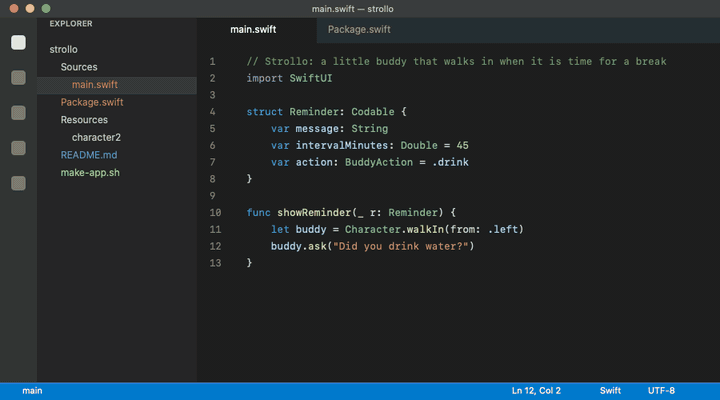
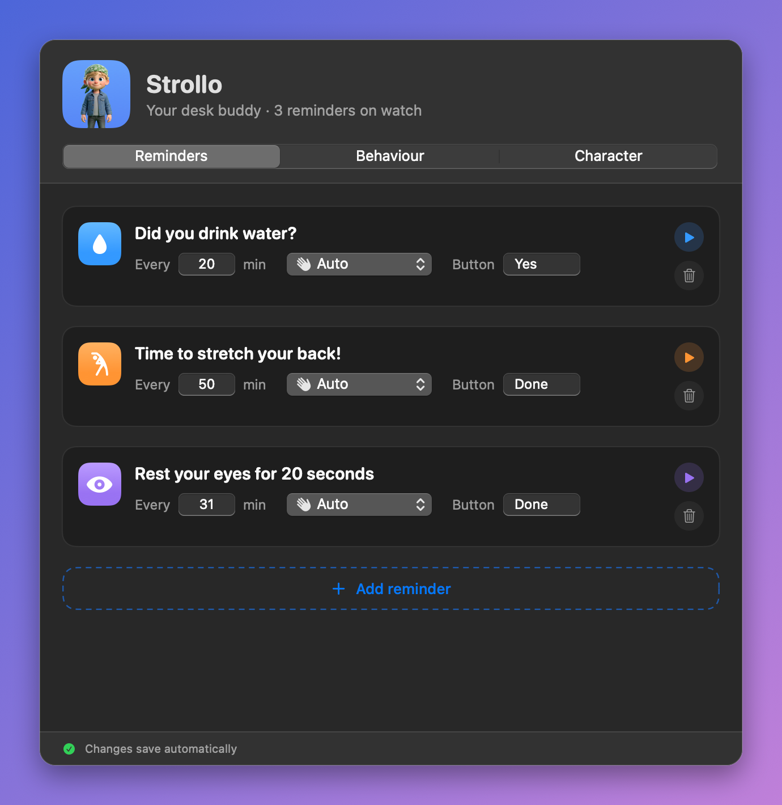
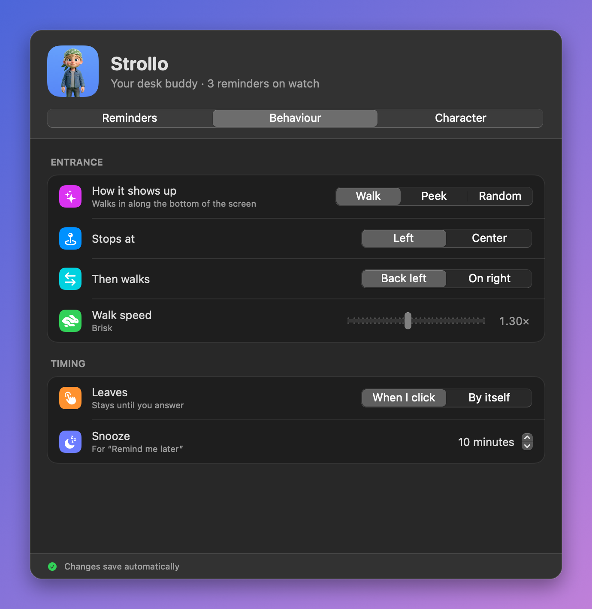
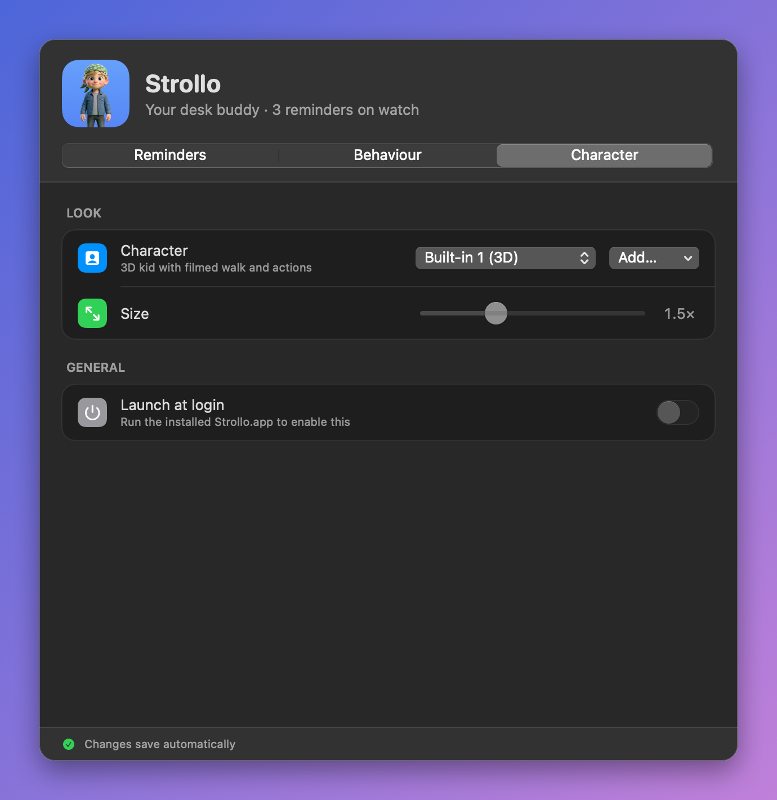
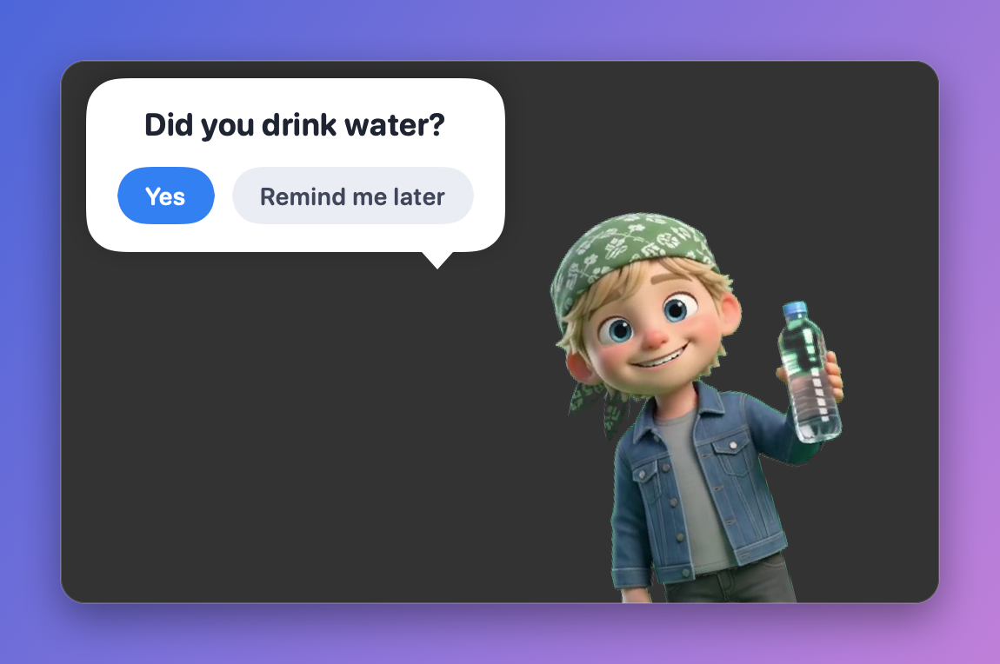
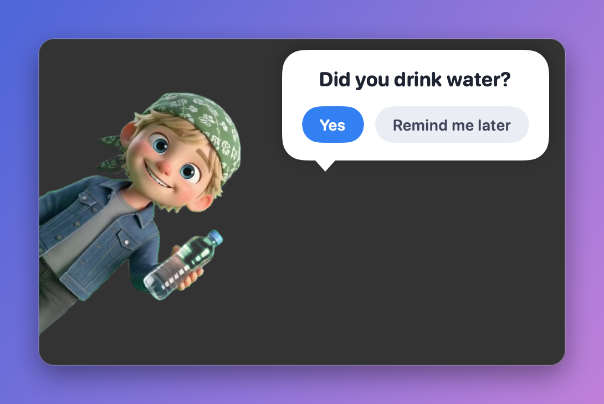
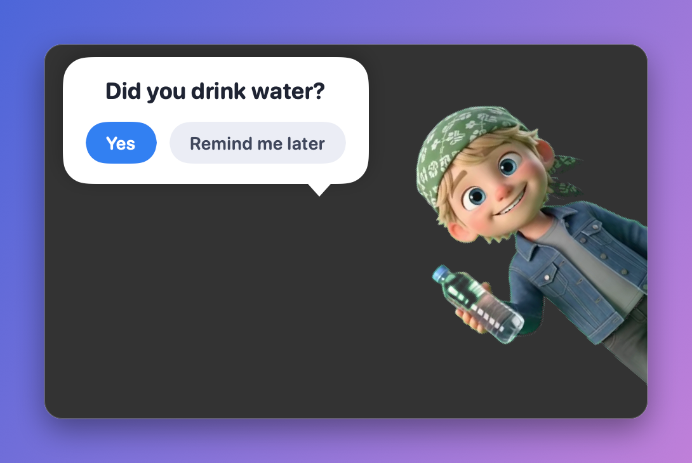

<h1 align="center">Strollo</h1>

<p align="center">
  <b>A tiny 3D buddy that walks across your screen when it's time to drink water, stretch, or rest your eyes.</b><br>
  Native macOS menu bar app. No account, no network, nothing leaves your Mac.
</p>

<p align="center">
  <a href="https://github.com/kaisarsofi/strollo/releases/latest/download/Strollo.dmg"></a>
</p>
<p align="center"><sub>Free · macOS 13+ · <a href="#install">install notes</a> · <a href="https://github.com/kaisarsofi/strollo/releases">all releases</a></sub></p>

<p align="center">
  <a href="https://github.com/kaisarsofi/strollo/releases/latest"></a>
  <a href="https://github.com/kaisarsofi/strollo/stargazers"></a>
  
  
  <a href="LICENSE"></a>
</p>

<p align="center">
  
</p>

Notifications are easy to ignore. A little character who strolls in, holds up a water bottle and waits for your answer is not. Strollo plays a short, friendly animation for each reminder, then walks off until the next one.

## Features

- **Real animations, not a pop-up.** The built-in character walks in with a filmed walk cycle and then acts out the reminder: sipping from a bottle, stretching (arms up, side bends, shoulder rolls), looking left and right and covering its eyes, or waving.
- **A hoverboard getaway.** After you answer, the buddy hops on a glowing hoverboard and zooms off across the screen in about a second and a half (or just walks off, if you prefer).
- **Walk in or peek in.** It can stroll in along the bottom of the screen, or peek in from any of 8 spots (corners and edges), or pick one at random each time.
- **Fully configurable.** Edit the messages, intervals, button labels and animation for every reminder; choose where it stops and which way it leaves; set the walk speed; decide whether it waits for your click or goes away by itself and comes back later.
- **Two built-in characters, or bring your own.** A 3D kid (default) and a drawn buddy, plus support for your own pose images and filmed clips.
- **Polite.** One reminder at a time, a quiet gap between them, and an ignored reminder comes back once, not over and over.
- **Launch at login**, a menu bar item to trigger any reminder on demand, and a one-click preview from Settings.
- **Light and private.** Pure Swift and SwiftUI, no Electron, no analytics, no network access. Settings live on your Mac.

## Screenshots

<p align="center">
  
  
</p>
<p align="center">
  
</p>

### Peek from anywhere

<p align="center">
  
  
  
</p>

## Install

1. **[Download Strollo.dmg](https://github.com/kaisarsofi/strollo/releases/latest/download/Strollo.dmg)** and open it.
2. Drag **Strollo** onto the **Applications** shortcut in the window. (A `Strollo.zip` is on the [releases page](https://github.com/kaisarsofi/strollo/releases/latest) too, if you prefer it.)
3. **First launch:** the app isn't notarized by Apple (that needs a paid developer account), so macOS will say it can't verify it. Right-click the app and choose **Open**, then **Open** again. If macOS still refuses, run this once in Terminal:

   ```bash
   xattr -dr com.apple.quarantine /Applications/Strollo.app
   ```
4. Look for the walking-figure icon in the menu bar. Choose **Settings…** to make it yours.

Requires macOS 13 (Ventura) or newer.

## Build from source

You need Xcode's command line tools (Swift 5.9 or newer). No Xcode project required.

```bash
git clone https://github.com/kaisarsofi/strollo.git
cd strollo
./make-app.sh          # builds and installs Strollo.app into ~/Applications, then opens it
```

Run the automated checks (scheduler, walk and peek flows) with:

```bash
swift build && .build/debug/Strollo --self-test
```

## Use your own character

In **Settings → Character → Add…** choose either:

- **A single image**: any PNG with a transparent background. It bobs and sways as it walks.
- **A pose folder**: transparent PNGs named `walk1`, `walk2`, `wave`, `drink1`, `drink2`, `stretch1`, `stretch2`, `eyes` and `idle`, which the app switches between. Optional extras (`walk3`, `walk4`, `drink3`, `eye2`, `eye3`, `shoulders`, `hang`) make the animations smoother.

For the smoothest result, film each action as a short green-screen video (an AI video tool works) and convert it to frames with the helpers in [`tools/`](tools): `prepare-character.swift` for stills, `prepare-walk.swift` for a walk-in-place cycle and `prepare-clip.swift` for drink, stretch, eyes, wave and hoverboard clips.

## Release notes

### v1.1.0

- New: a hoverboard exit. After you answer, the character hops on a hoverboard and dashes across the screen. Choose "Hoverboard" or "Walking" under Settings → Behaviour → Leaves by.
- Now also available as a `Strollo.dmg` with a drag-to-Applications window.
- Version number and download size updated (the app grew by about 10 MB for the board footage).

### v1.0.0

The first public release.

- Filmed 3D walk, drink, stretch, rest-eyes and wave animations (the default character).
- Walk-in and peek entrances: 8 peek positions, or random.
- Settings window with Reminders, Behaviour and Character tabs.
- Configurable walk speed, snooze time, stopping point, exit direction and wait-or-auto-leave.
- A scheduler that shows one reminder at a time, with a quiet gap, and never piles up repeats.
- Launch at login, menu bar triggers, live preview that interrupts whatever is on screen.
- Built-in drawn character as an alternative, and support for custom characters.

## Contributing

Strollo is open source, but the repository is maintained by one person and does not accept direct pushes. You are welcome to fork it, and to open an issue or a pull request, which will be reviewed.

## Credits and licence

Code is released under the [MIT licence](LICENSE).

The built-in 3D character artwork was generated with Google Gemini for this project. It is included so the app works out of the box; if you reuse it, check Google's current terms for generated content.
